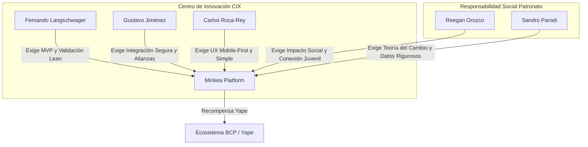

# Análisis de Probabilidad de Jurados para la Defensa de Minkea

Minkea es una plataforma que moviliza a la juventud hacia el impacto social y comunitario a través de la gamificación y recompensas integradas en el ecosistema Yape/BCP. Para la defensa del proyecto de mañana, analizamos los perfiles del **Centro de Innovación BCP (CIX)** y del **Patronato BCP** para estimar quiénes serán los jurados más probables y cómo prepararnos ante sus perfiles.

---

## 1. Criterios para Asignar las Probabilidades

Para calcular la probabilidad de participación de cada perfil en el jurado evaluador, utilizaremos cuatro criterios ponderados:

1. **Alineación Temática con Minkea (35%):** ¿El perfil aborda temas de impacto social y juvenil (Patronato) o diseño de experiencias digitales de cara al cliente y Yape (CIX)?
2. **Rol Operativo vs. Corporativo (25%):** Los ejecutivos del C-Suite (p. ej. Diego Cavero, Cesar Ríos) suelen delegar las evaluaciones operativas o técnicas, participando solo en grandes finales. Los gerentes operativos y directores ejecutan la evaluación real del MVP.
3. **Historial de Participación en Eventos y Mentorías (20%):** Perfiles con registro de participación recurrente en Hackathons, Innovathons, mesas de jurado y mentorías locales.
4. **Enfoque de Producto Específico (20%):** Dado que Minkea depende de la conversión de puntos y alianzas con comercios/Yape, los perfiles de alianzas estratégicas o banca minorista masiva tienen mayor peso frente a productos de nicho (como telemedicina o remesas internacionales).

---

## 2. Los 5 Jurados más Probables para Mañana

A continuación, se detallan los 5 miembros con mayor probabilidad de integrar el jurado evaluador, ordenados de mayor a menor probabilidad.

### 1. Reegan Orozco (Directora Ejecutiva, Patronato BCP)
* **Probabilidad Estimada:** **95%** (Extremadamente Alta)
* **Origen:** Patronato BCP
* **Por qué estará:** Es el rostro público y operativo del Patronato. Apasionada por el talento juvenil y la innovación social. Exespecialista de Pronabec.
* **Foco de su Evaluación:** Bienestar y salud mental de los jóvenes, accesibilidad (UX sin barreras digitales) y acompañamiento/comunidad para evitar la deserción.
* **Estrategia Minkea:** Enfatiza que Minkea no es solo "voluntariado aburrido", sino un espacio seguro de socialización y soporte que cuida la salud mental del joven y genera comunidad con mentorías.
* **Pregunta Clave:** *"¿Cómo ayuda la plataforma a identificar casos de desinterés o problemas socioemocionales de forma preventiva para evitar el abandono de las Minkas?"*

### 2. Fernando Langschwager (Gerente del CIX BCP)
* **Probabilidad Estimada:** **90%** (Muy Alta)
* **Origen:** CIX (InnovaCXión)
* **Por qué estará:** Es el líder del laboratorio de innovación. Exemprendedor y muy activo como jurado y mentor en hackathons e Innovation Days del BCP.
* **Foco de su Evaluación:** Metodología Lean Startup (MVP práctico), validación real con usuarios y diseño centrado en el usuario (experiencias "WoW").
* **Estrategia Minkea:** Presenta el pitch con una mentalidad de fundador de startup. Habla de hipótesis validadas en campo, datos en lugar de suposiciones, y explica por qué Yape/BCP se beneficia de este canal externo en lugar de construirlo internamente.
* **Pregunta Clave:** *"¿Cuál es la hipótesis más arriesgada de Minkea y cómo planean validarla de la forma más barata y rápida posible?"*

### 3. Gustavo Jiménez (Head of Partnerships / Alianzas, CIX BCP)
* **Probabilidad Estimada:** **80%** (Alta)
* **Origen:** CIX (InnovaCXión)
* **Por qué estará:** Lidera la Innovación Abierta y la conexión con startups en BCP. Exgerente de proyectos ágiles en MiBanco. Evaluador frecuente en foros de capital de riesgo y ecosistema fintech.
* **Foco de su Evaluación:** Escalabilidad comercial, viabilidad de alianzas (Open Innovation), modelo de negocio ganar-ganar para el banco y riesgos operativos.
* **Estrategia Minkea:** Resalta el flujo que conecta las acciones con la inyección de puntos Yape, mostrando un modelo viable de alianzas de innovación abierta. Habla de pilotos ágiles rápidos sin comprometer la seguridad central del banco.
* **Pregunta Clave:** *"¿Cómo planean integrar tecnológicamente su solución de puntos con el ecosistema de Yape sin generar fricciones de seguridad o compliance?"*

### 4. Carlos Roca-Rey (Product Manager de Banca Minorista, CIX BCP)
* **Probabilidad Estimada:** **75%** (Alta)
* **Origen:** CIX (InnovaCXión)
* **Por qué estará:** PM responsable de productos retail masivos (como Warda, Cocos y Lucas o Cuotéalo). Especialista en diseño móvil, UX/UI ágil y descubrimiento de producto.
* **Foco de su Evaluación:** Simplicidad móvil (Mobile-First UX), carga cognitiva mínima, retención de usuarios y el *Core Loop* del producto.
* **Estrategia Minkea:** Muestra el prototipo móvil mobile-first pulido. Explica el flujo interactivo de 3 pasos (Descubrimiento, Conexión y Acción) y cómo las mecánicas de gamificación retienen al usuario.
* **Pregunta Clave:** *"¿Cómo definieron el alcance de su MVP y qué funcionalidades decidieron dejar fuera para priorizar el lanzamiento y evitar la sobrecarga del usuario?"*

### 5. Sandro Parodi (Miembro Externo del Consejo, Patronato BCP)
* **Probabilidad Estimada:** **60%** (Moderada-Alta)
* **Origen:** Patronato BCP
* **Por qué estará:** Exdirector de Pronabec y exviceministro del MINEDU. Investigador de GRADE y economista de Harvard Kennedy School.
* **Foco de su Evaluación:** Rigurosidad en la medición del impacto social (Teoría del Cambio), sinergia público-privada e indicadores cualitativos y cuantitativos sólidos.
* **Estrategia Minkea:** Demuestra una teoría del cambio lógica que vincule la participación comunitaria con la mejora de la empleabilidad y educación de los jóvenes. Muestra que Minkea complementa (no duplica) esfuerzos estatales.
* **Pregunta Clave:** *"¿Cuál es la Teoría del Cambio que sustenta Minkea y cómo medirán el impacto neto de la plataforma frente a un grupo de control?"*

---

## 3. Matriz General de Posibles Jurados y Ponderaciones

A continuación se muestra el análisis expandido del resto de los perfiles identificados en el proyecto:

| Nombre | Origen | Probabilidad | Criterio Principal / Justificación |
| :--- | :--- | :--- | :--- |
| **Reegan Orozco** | Patronato | **95%** | Lidera de forma directa las operaciones del Patronato y la marca Becas BCP. |
| **Fernando Langschwager** | CIX | **90%** | Gerente de CIX y habitual mentor/jurado de hackathons de BCP. |
| **Gustavo Jiménez** | CIX | **80%** | Clave para evaluar alianzas Yape-Minkea y el ecosistema fintech. |
| **Carlos Roca-Rey** | CIX | **75%** | PM especializado en UX retail masivo y flujos de apps móviles. |
| **Sandro Parodi**| Patronato | **60%**| Enfoque en métricas cuantitativas y políticas públicas de impacto juvenil. |
| **Marilú Martens** | Patronato | **55%** | Exministra. Gran peso externo, ideal si el proyecto destaca en igualdad de género y educación. |
| **Fiorella Mendoza** | CIX | **45%** | PM de Mandadito. Su enfoque está en remesas internacionales; es menos prioritario para el ecosistema nacional. |
| **Enrique Pasquel** | Patronato | **40%** | Presidente del Consejo. Muy corporativo. Estará si es la Gran Final por impacto reputacional. |
| **Diego Cavero / Cesar Ríos** | Patronato | **10%** | Asamblea General. Nivel corporativo C-Suite. Delegarán la evaluación. |
| **Eduardo Ortega / Diego Lamas** | CIX | **30%** | PMs de Telemedicina y Crédito PYME. Menos alineación temática directa con Minkea. |

---

## 4. Mapa del Jurado Balanceado (CIX vs. Patronato)

Minkea debe lograr convencer a los dos perfiles del jurado que representan fuerzas complementarias en el banco. El siguiente diagrama muestra cómo interactúan ambas áreas con la plataforma:

---

> [!TIP]
> **Preparación para la Defensa de Mañana:**
> 1. **La sección de Yape/Puntos:** Prepárense bien para las preguntas de **Gustavo Jiménez** y **Carlos Roca-Rey** sobre la integración del prototipo con Yape. Recuerden no mezclar los CTAs y mantener el modal del bottom-sheet de compartir separado, para no diluir el botón de "Beneficios BCP" (el cual encanta al jurado de CIX porque cierra el modelo operativo).
> 2. **El impacto social:** Estén listos con una historia (Storytelling) para **Reegan Orozco** y datos de impacto/retención para **Sandro Parodi**.
