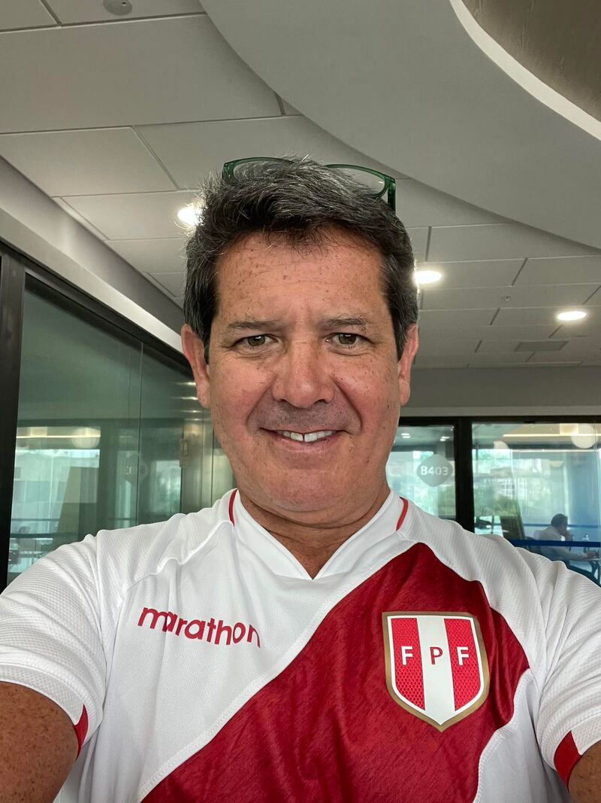

# Perfil de Jurado: Diego Cavero Belaunde

## Información General
* **Cargo Actual:** Gerente General (CEO) del Banco de Crédito del Perú (BCP) y Head de Banca Universal de Credicorp.
* **Rol en el Patronato:** Miembro de la Asamblea General (en representación del Banco de Crédito del Perú BCP) y miembro del Consejo Directivo de la [Asociación Patronato BCP](file:///D:/minkea/base/jurados/patronato_bcp.md).
* **Formación Académica:** 
  * Bachiller en Administración de Empresas de la Universidad de Lima.
  * MBA de la Universidad de Texas en Austin, EE. UU.
* **Trayectoria en la Organización:** Más de 30 años en BCP y Credicorp (ingresó en 1994 como practicante y ascendió hasta la gerencia general).

---

## Trayectoria Profesional y Logros Clave

* **Crecimiento Orgánico e Interno:** Su historia en el BCP representa la de un profesional que conoce el banco desde sus cimientos. Ha pasado por múltiples áreas críticas que le otorgan una perspectiva integral del negocio y de la gestión operativa.
* **Liderazgo en Bolivia (2008 - 2012):** Se desempeñó como Gerente General de BCP Bolivia. Él mismo ha calificado esta etapa como una de las más retadoras y de mayor aprendizaje de su carrera, ya que tuvo que liderar la institución bajo contextos de alta incertidumbre social y política, lo cual consolidó su capacidad para tomar decisiones difíciles y gestionar riesgos en entornos inestables.
* **Banca Corporativa y Mayorista:** Dirigió la División de Banca Corporativa y Banca Empresarial, teniendo a su cargo la relación con las corporaciones y empresas más grandes del país.
* **Enfoque en Eficiencia y Procesos:** Lideró la División de Eficiencia, Administración y Procesos. Este rol le dio una gran sensibilidad hacia el control de costos, la optimización de procesos operativos, la productividad y la reingeniería interna.

---

## Visión y Enfoques Clave

### 1. Responsabilidad Social e Impacto Genuino
Sostiene firmemente que las empresas del sector privado deben ser **"parte de la solución"** ante problemas estructurales como la pobreza, la informalidad y la falta de oportunidades. Bajo su liderazgo, el BCP ha impulsado activamente:
* **Educación como Base del Progreso:** Defiende la educación como el motor principal de la movilidad social. Respalda fuertemente el programa de **Becas BCP**, que busca transformar la vida de jóvenes talentosos de bajos recursos.
* **Obras por Impuestos:** Ha liderado la ejecución de proyectos de infraestructura bajo este mecanismo (superando los S/ 1,100 millones invertidos en infraestructura educativa, colegios de alto rendimiento, agua y saneamiento).

### 2. Transformación Digital e Inclusión
Para Diego Cavero, la tecnología debe servir para democratizar el acceso y facilitar la vida de las personas:
* **El Fenómeno Yape:** Ha sido un promotor clave de la expansión y diversificación de Yape como el canal principal de inclusión financiera y digitalización de los microempresarios y sectores informales en el Perú.
* **Adopción de Tecnologías Emergentes:** Impulsa el uso de Inteligencia Artificial (IA) y metodologías ágiles para hacer al banco más rápido, simple y cercano al cliente, pero siempre cuidando que la tecnología no deshumanice la atención.

### 3. Liderazgo Humano y Empático
Cree en evolucionar hacia un liderazgo centrado en las personas, la empatía y el servicio. Considera que un buen líder debe estar dispuesto a escuchar, ser cercano a sus equipos y actuar con valores corporativos sólidos.

---

## Estrategia para el Pitch y Defensa del Proyecto

Para lograr una conexión efectiva y convencer a Diego Cavero, debemos alinear nuestro discurso con sus prioridades y anticipar su mentalidad como evaluador.

### Ganchos de Empatía (Conceptos clave a incorporar)
* **"Propósito Social con Sostenibilidad":** Evitar que el proyecto parezca solo filantropía temporal; demostrar cómo se sostiene en el tiempo.
* **"Inclusión con Simplicidad":** Resaltar la facilidad de uso del producto/servicio para el usuario final (usar la simplicidad de Yape como analogía).
* **"Resiliencia y Adaptabilidad":** Mostrar cómo el proyecto está preparado para operar de manera óptima bajo escenarios adversos o de alta incertidumbre.
* **"Eficiencia de Recursos":** Destacar que la solución optimiza costos y maximiza el valor por cada sol invertido.

### Preguntas Difíciles Esperadas y Cómo Responderlas

#### 1. ¿Cómo garantiza este proyecto su sostenibilidad operativa y financiera a mediano y largo plazo sin depender de financiamiento externo continuo?
* **Enfoque de respuesta:** Detallar el modelo de costos operativos y el plan de viabilidad a largo plazo. Explicar las eficiencias del proceso y cómo la tecnología reduce costos de escala. Demostrar que hemos cuantificado y optimizado los costos operativos de la solución.

#### 2. Ante un escenario de alta incertidumbre macroeconómica o social en las regiones de intervención, ¿cómo se adapta o pivota el proyecto para no perder continuidad?
* **Enfoque de respuesta:** Mostrar planes de contingencia claros. Explicar la flexibilidad de la infraestructura propuesta (por ejemplo, adaptabilidad digital, descentralización del soporte o metodologías ágiles de despliegue) para responder rápido ante cambios del entorno.

#### 3. ¿Cómo medimos el impacto cualitativo real en los beneficiarios? No solo métricas de registro o alcance, sino transformación de vida.
* **Enfoque de respuesta:** Presentar un marco de medición de impacto que vaya más allá de las descargas o registros. Mostrar indicadores de desarrollo personal/profesional (ej. retención académica, inserción laboral o incremento de ingresos en las familias del proyecto), alineados con los Objetivos de Desarrollo Sostenible (ODS).

#### 4. En un país con alta informalidad y brecha digital, ¿cómo asegura que el usuario final realmente pueda y quiera usar esta solución?
* **Enfoque de respuesta:** Resaltar el diseño centrado en el usuario (UX/UI inclusiva). Mencionar pruebas de campo con usuarios reales y cómo se ha minimizado la curva de aprendizaje (soporte interactivo, interfaces simples o integración con canales de uso diario).

---

## Fuentes de Información
* **Perfil Corporativo y Trayectoria:** [Memoria Anual Credicorp - Diego Cavero](https://www.grupocredicorp.com)
* **LinkedIn Oficial de la Organización:** [BCP en LinkedIn](https://www.linkedin.com/company/bancodecreditodelperu/)
* **Entrevistas e Insights de Gestión:** [Universidad de Lima - Egresados Destacados](https://www.ulima.edu.pe)
* **Búsqueda Directa en LinkedIn:** [Resultados de búsqueda para Diego Cavero Belaunde](https://www.linkedin.com/search/results/all/?keywords=Diego%20Cavero%20Belaunde)
