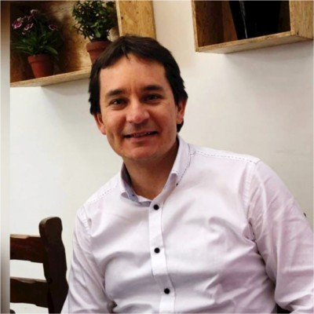

# Perfil de Jurado: Erickson Molina Pradel

## Información General
* **Cargo Actual:** Especialista Sénior en Asuntos Corporativos del BCP / Credicorp.
* **Rol en el Patronato:** Vicepresidente del Consejo Directivo de la [Asociación Patronato BCP](file:///D:/minkea/base/jurados/patronato_bcp.md) (segunda máxima autoridad en la toma de decisiones estratégicas del Patronato).
* **Formación Académica:** 
  * Abogado por la Pontificia Universidad Católica del Perú (PUCP).
  * Maestro en Ciencia Política y Relaciones Internacionales por la PUCP.
* **Trayectoria:** Abogado especializado en Derecho de la Competencia, Protección al Consumidor y Cumplimiento Ético, con una sólida base académica y experiencia tanto en el sector público como en el privado.

---

## Trayectoria Profesional y Logros Clave

* **Cumplimiento Normativo y Ética en el BCP:** Forma parte clave de la gestión de cumplimiento en Asuntos Corporativos del BCP. Es uno de los coordinadores y supervisores de la política **"GenÉTICA"** (el programa integral de ética, transparencia y conducta de Credicorp). Lidera y asesora en la implementación de directrices corporativas asociadas a la prevención de lavado de activos, cumplimiento de leyes internacionales (FATCA, CRS, regulaciones OFAC) y el fomento de la libre competencia.
* **Liderazgo en Protección al Consumidor (INDECOPI):** Se desempeñó como Secretario Técnico de la Comisión de Protección al Consumidor Nº 1 de INDECOPI (la entidad estatal que vela por los derechos del consumidor y la lealtad comercial en el Perú). Conoce al detalle las normativas y sanciones asociadas a la publicidad engañosa, cláusulas abusivas y derechos del usuario.
* **Experiencia en Firmas Legales:** Trabajó como asociado sénior liderando áreas especializadas en Derecho de la Competencia, Competencia Desleal y Propiedad Intelectual en Benites, Forno & Ugaz (luego Benites, Vargas & Ugaz), una de las firmas de abogados corporativos más reconocidas del país.
* **Docente de Comunicación Jurídica (PUCP):** Cuenta con una amplia trayectoria como docente en la Facultad de Derecho y Estudios Generales Letras de la PUCP. Ha dictado cursos como *Introducción al Funcionamiento del Sistema de Justicia*, *Introducción a las Ciencias Jurídicas*, e *Introducción a la Comunicación Jurídica Eficaz*, lo cual refleja su alto estándar para la estructuración lógica y retórica de argumentos.

---

## Visión y Enfoques Clave

### 1. Cultura de Ética y Cero Tolerancia al Fraude (Lente "GenÉTICA")
Para Erickson Molina, cualquier iniciativa vinculada al BCP debe regirse por los más altos estándares éticos:
* **Transparencia en el Destino de Fondos:** En proyectos sociales o financieros, el flujo de dinero y la asignación de beneficios deben ser completamente auditables y libres de cualquier sombra de corrupción o favoritismo.
* **Prevención de Riesgos de Conducta:** Valora la existencia de un "código de ética de la plataforma" y canales donde los usuarios puedan denunciar malas prácticas.

### 2. El Consumidor en el Centro (Lente INDECOPI)
Debido a su pasado en INDECOPI, defiende con firmeza que la plataforma debe respetar de forma irrestricta al usuario final:
* **Diseño sin Engaños (Anti-Dark Patterns):** No tolerará flujos de diseño web que confundan al usuario para que acepte términos indeseados o que oculten información importante bajo tipografías ilegibles o lenguaje confuso.
* **Términos y Condiciones Sencillos:** Aboga porque las políticas legales y el acuerdo de usuario estén redactados en un español claro, simple y accesible para personas de cualquier nivel educativo.

### 3. Comunicación Estructurada y Eficaz
Como docente de comunicación jurídica:
* Valora las presentaciones que van directo al grano, que siguen un hilo lógico riguroso y que definen con precisión los conceptos técnicos y legales.
* Evalúa con ojo crítico la solidez de la argumentación durante la defensa del pitch.

---

## Estrategia para el Pitch y Defensa del Proyecto

Para lograr una evaluación sobresaliente de Erickson Molina, el equipo debe demostrar que el proyecto es éticamente intachable, protege rigurosamente los derechos de sus usuarios y se expone con una estructura lógica impecable.

### Ganchos de Empatía (Conceptos clave a incorporar)
* **"Transparencia Activa":** Mostrar de manera clara cómo el usuario final sabe en todo momento qué se hace con sus datos o recursos.
* **"Diseño Centrado en el Respeto al Usuario":** Explicar que la UX/UI se diseñó para evitar la confusión del usuario, alineada con las mejores prácticas de protección al consumidor.
* **"Marco de Cumplimiento Integrado (Compliance)":** Demostrar que el proyecto posee controles para mitigar riesgos de conducta y evitar fraudes o mal uso de la plataforma.
* **"Comunicación Clara y Sin Fricciones":** Expresar las ideas con precisión terminológica, evitando evasivas y respondiendo con datos estructurados.

### Preguntas Difíciles Esperadas y Cómo Responderlas

#### 1. ¿Cómo garantizan que el usuario final de la plataforma entienda de manera efectiva sus derechos y las condiciones del servicio, evitando asimetrías de información?
* **Enfoque de respuesta:** Explicar el enfoque de "Legal Design" o lenguaje sencillo. "Hemos diseñado los términos y condiciones utilizando resúmenes visuales e infografías sencillas dentro de la aplicación. Antes de que el usuario acepte el acuerdo, se le muestran los tres puntos críticos (privacidad, responsabilidades y uso) en lenguaje coloquial, garantizando una comprensión real".

#### 2. En caso de detectarse un mal uso de la plataforma, un intento de fraude, o suplantación de identidad de un beneficiario, ¿cuál es el protocolo ético y de cumplimiento operativo establecido?
* **Enfoque de respuesta:** Mostrar un protocolo de control y auditoría. "El proyecto cuenta con un sistema de alertas tempranas. Ante comportamientos atípicos, se suspende la cuenta temporalmente para verificación. Adicionalmente, el proyecto adopta directrices de cumplimiento ético similares a 'GenÉTICA', con un canal de reporte anónimo para denunciar cualquier sospecha de irregularidad por parte de operadores o usuarios".

#### 3. ¿El proyecto respeta las directrices de libre competencia y acceso equitativo para los posibles proveedores o aliados estratégicos que participen en él?
* **Enfoque de respuesta:** Detallar los criterios objetivos de selección. "La plataforma funciona bajo un esquema abierto y transparente. El acceso de socios universitarios, mentores o proveedores de servicios se rige bajo criterios objetivos y públicos de selección, garantizando neutralidad y libre competencia, sin exclusividades que distorsionen el mercado".

---

## Fuentes de Información
* **Perfil Docente y Académico PUCP:** [Directorio de Profesores - PUCP](https://www.pucp.edu.pe)
* **Documentos de Ética y Sostenibilidad Credicorp:** [Reportes Corporativos y GenÉTICA](https://www.grupocredicorp.com)
* **Resoluciones y Trayectoria Legal:** [Secretaría Técnica de INDECOPI](https://www.gob.pe/indecopi)
* **Búsqueda Directa en LinkedIn:** [Resultados de búsqueda para Erickson Molina Pradel](https://www.linkedin.com/search/results/all/?keywords=Erickson%20Molina%20Pradel)
