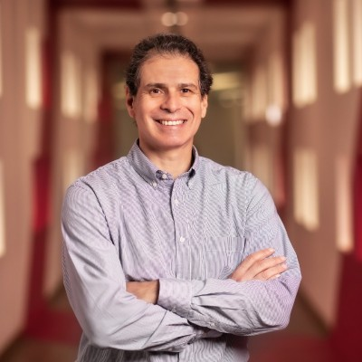

# Perfil de Jurado: Karim Mitre Calderón

## Información General
* **Cargo Actual:** Gerente de la División de Gestión y Desarrollo Humano (GDH) y Administración del Banco de Crédito del Perú (BCP) y de Credicorp.
* **Rol en el Patronato:** Miembro del Consejo Directivo de la [Asociación Patronato BCP](file:///D:/minkea/base/jurados/patronato_bcp.md) (órgano encargado de orientar la estrategia y supervisar el impacto social del Patronato).
* **Formación Académica:** 
  * Bachiller en Ciencias Económicas con especialidad en Relaciones Internacionales.
  * Magíster (MSc) en Política y Desarrollo Latinoamericano por la London School of Economics and Political Science (LSE), Inglaterra.
* **Trayectoria:** Más de 25 años en el BCP y el grupo Credicorp (ingresó en 1997 en la División de Mercado de Capitales).

---

## Trayectoria Profesional y Logros Clave

* **Liderazgo Corporativo en Gestión de Personas:** Lidera la estrategia de talento, cultura, bienestar y administración para todo el holding Credicorp y el BCP. Regresó a esta posición en abril de 2022 tras haber ocupado la gerencia de planeamiento en la misma división años atrás.
* **Experiencia Multisectorial dentro del Grupo:** En diciembre de 2010 asumió el cargo de Gerente de la División de Administración y Gestión y Desarrollo Humano en Pacífico Seguros (empresa de seguros de Credicorp), lo que consolidó su experiencia en reestructuración cultural y administración en diversos rubros financieros.
* **Foco en el Ecosistema Educativo y Empleabilidad:** Es una participante sumamente activa en foros de liderazgo y educación juvenil en el Perú. Colabora frecuentemente en eventos como el **CADE Universitario** (organizado por IPAE), impulsando la empleabilidad juvenil, el liderazgo con propósito y el cierre de brechas educativas en el país.

---

## Visión y Enfoques Clave

### 1. Educación Conectada con la Empleabilidad (Lente GDH)
Como líder de Gestión y Desarrollo Humano, entiende que la educación superior no debe ser solo teórica, sino un puente directo hacia el mercado de trabajo:
* Valora proyectos que preparen a los jóvenes con habilidades técnicas altamente demandadas por las empresas del mercado laboral actual.
* Busca que las iniciativas doten a los beneficiarios de capacidades de adaptabilidad, agilidad y resiliencia profesional.

### 2. Acompañamiento Humano y Mentoría Integral
Su especialidad en personas le hace comprender que el éxito de un estudiante no depende únicamente de la financiación o el acceso a la tecnología:
* Defiende la importancia de la **mentoría** y el soporte socioemocional para evitar la deserción de jóvenes con recursos limitados.
* Valora la creación de redes de soporte (voluntariado de profesionales, mentores corporativos) que guíen al estudiante en su transición al mundo profesional.

### 3. Desarrollo Social y Equidad (Lente LSE)
Su formación de maestría en la London School of Economics (LSE) le otorga una sólida base en teoría del desarrollo, desigualdad y políticas sociales en América Latina:
* Analiza los proyectos bajo el lente del impacto estructural en la **movilidad social** y la equidad.
* Es sensible a la inclusión de la diversidad de género, accesibilidad física o digital, y la equidad en los procesos de selección de beneficiarios.

---

## Estrategia para el Pitch y Defensa del Proyecto

Para lograr una conexión efectiva y convencer a Karim Mitre, el equipo debe enfatizar el pilar humano del proyecto, su impacto en la inserción laboral y el acompañamiento que reciben los usuarios.

### Ganchos de Empatía (Conceptos clave a incorporar)
* **"Inserción Laboral y Empleabilidad Activa":** Mostrar cómo el proyecto eleva las probabilidades de que el beneficiario consiga un empleo de calidad.
* **"Mentoría y Redes de Soporte Humano":** Resaltar el rol de los tutores o mentores en el acompañamiento del usuario durante el uso de la plataforma.
* **"Desarrollo de Habilidades Socioemocionales (Soft Skills)":** Explicar que la solución complementa la educación técnica con formación en liderazgo, comunicación y adaptabilidad.
* **"Proceso de Selección Equitativo y Diverso":** Destacar los criterios inclusivos y libres de sesgos en el acceso a la plataforma.

### Preguntas Difíciles Esperadas y Cómo Responderlas

#### 1. ¿De qué manera garantiza este proyecto que los usuarios desarrollen habilidades blandas y de liderazgo esenciales para el mercado laboral actual, más allá de la capacitación puramente técnica?
* **Enfoque de respuesta:** Detallar los módulos complementarios de la plataforma. "Nuestro plan de estudios no es solo técnico. Contamos con talleres integrados de habilidades socioemocionales (comunicación asertiva, resolución de problemas y adaptabilidad). Además, la interacción obligatoria con mentores simula el entorno laboral real, forzando la práctica de estas competencias de forma cotidiana".

#### 2. En programas dirigidos a jóvenes vulnerables, la deserción por factores emocionales o familiares es muy alta. ¿Cómo previene y gestiona la plataforma esta problemática?
* **Enfoque de respuesta:** Presentar el modelo de mentoría estructurada y seguimiento. "Hemos implementado una red de acompañamiento continuo. Cada usuario cuenta con un mentor asignado que realiza sesiones periódicas de seguimiento. Adicionalmente, la plataforma posee alertas predictivas que detectan inactividad o bajo rendimiento, permitiendo al equipo de soporte humano intervenir proactivamente con tutorías o consejería".

#### 3. ¿Cómo aseguran que el proceso de postulación y selección de beneficiarios en la plataforma sea equitativo y esté libre de sesgos de género o socioeconómicos?
* **Enfoque de respuesta:** Explicar los filtros objetivos y el diseño inclusivo. "El proceso de selección utiliza criterios ciegos en la primera fase para evaluar únicamente el potencial y la necesidad, eliminando sesgos iniciales de género o procedencia. Además, el diseño del aplicativo es accesible para personas con discapacidades visuales o baja conectividad, garantizando igualdad de oportunidades de postulación".

---

## Fuentes de Información
* **Directorio de Apoyo Consultoría y Gestión:** [Perfiles de Ponentes - SAE](https://www.sae-apoyoconsultoria.com)
* **Alianzas y Convenios Universitarios BCP:** [IPAE CADE Universitario - Artículos y Notas](https://www.ipae.pe)
* **Memoria Anual de Pacífico Seguros y BCP:** [Estructura Organizacional GDH](https://www.viabcp.com)
* **Búsqueda Directa en LinkedIn:** [Resultados de búsqueda para Karim Mitre Calderón](https://www.linkedin.com/search/results/all/?keywords=Karim%20Mitre%20Calder%C3%B3n)
