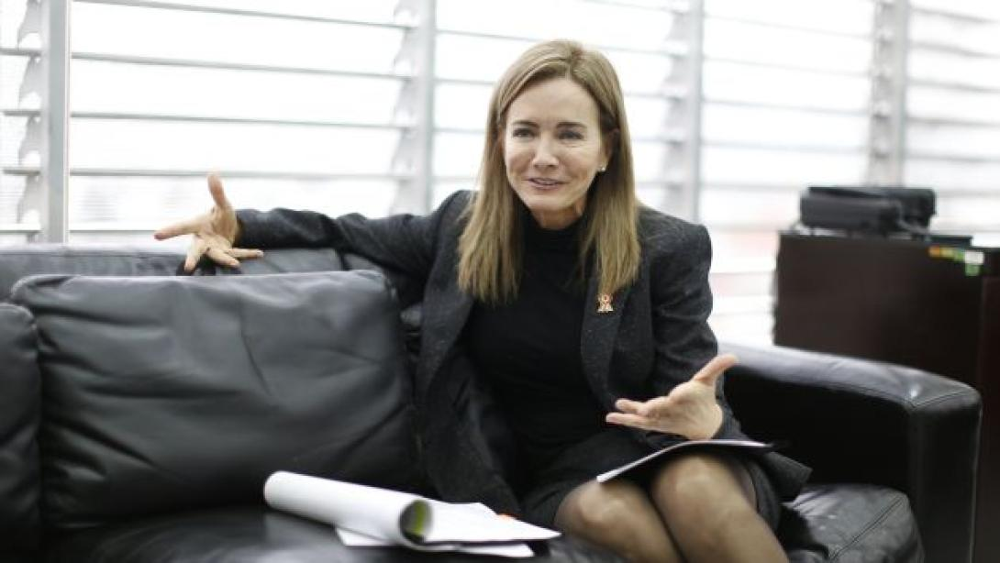

# Perfil de Jurado: Marilú Martens Cortés

## Información General
* **Cargo Actual:** Directora Nacional de CARE Perú (desde abril de 2020).
* **Rol en el Patronato:** Miembro Externo del Consejo Directivo de la [Asociación Patronato BCP](file:///D:/minkea/base/jurados/patronato/patronato_bcp.md) (aporta perspectiva externa, académica y de desarrollo social de alto impacto).
* **Formación Académica:** 
  * Licenciada en Educación con mención en Educación Especial por la Universidad Femenina del Sagrado Corazón (UNIFE).
  * Maestría en Psicopedagogía por la Universidad Andrés Bello (Chile) (*cum laude*).
  * Diplomados en "Enseñanza para la Comprensión" y "Preparación de Tutores" por la Universidad de Harvard, EE. UU.
* **Trayectoria:** Destacada educadora, gestora pública y especialista en políticas sociales y educativas del Perú. Exministra de Educación.

---

## Trayectoria Profesional y Logros Clave

* **Ministra de Educación del Perú (2016 - 2017):** Lideró la cartera del Ministerio de Educación (MINEDU), gestionando la reforma de la carrera pública magisterial, políticas de infraestructura y el fortalecimiento de la calidad educativa pública.
* **Creadora de la Red COAR (Colegios de Alto Rendimiento):** Como Directora General de Servicios Educativos Especializados del MINEDU, diseñó e implementó la red nacional de los Colegios de Alto Rendimiento (COAR), un modelo de excelencia pública para estudiantes sobresalientes de recursos limitados de todas las regiones del país.
* **Liderazgo en CARE Perú:** Dirige a nivel nacional CARE Perú, una de las ONGs internacionales de desarrollo social más importantes. Lidera programas complejos orientados a la equidad de género, el empoderamiento económico de las mujeres, la salud y la seguridad alimentaria en zonas vulnerables y rurales.
* **Gestión Educativa Superior:** Fue Vicerrectora de Innovación y Calidad de la Universidad de Ciencias y Artes de América Latina (UCAL) y miembro del directorio de instituciones técnicas y de educación superior (Certus, Toulouse Lautrec).

---

## Visión y Enfoques Clave

### 1. Pedagogía Activa y Centrada en el Estudiante
Como educadora especialista con formación en Harvard, rechaza la educación bancaria (donde el estudiante solo memoriza pasivamente):
* **Enseñanza para la Comprensión:** Valora las metodologías activas y plataformas digitales que desafíen al estudiante, promuevan el pensamiento crítico y aseguren un aprendizaje significativo.
* **Rol del Tutor:** Como especialista graduada en Preparación de Tutores de Harvard, considera que el tutor y mentor son pilares indispensables para el éxito educativo del estudiante, guiando no solo lo académico sino lo socioemocional.

### 2. Empoderamiento de la Mujer y Equidad de Género (Lente CARE)
A través de su liderazgo en CARE Perú, promueve la reducción de brechas de género en el acceso a la educación y el empleo formal:
* Presta especial atención a que los proyectos incluyan un enfoque de igualdad de oportunidades y de prevención de violencia o discriminación hacia las mujeres.
* Valora iniciativas que capaciten a mujeres jóvenes en áreas no tradicionales (tecnología, liderazgo, ciencias).

### 3. Movilidad Social y Descentralización (Efecto COAR)
Cree firmemente en el talento que existe en las regiones del Perú:
* Su visión es que la cuna no debe determinar el destino del estudiante. Aboga por llevar educación de la más alta calidad y oportunidades reales a jóvenes en zonas urbanas marginales y rurales.

---

## Estrategia para el Pitch y Defensa del Proyecto

Para interactuar eficazmente con Marilú Martens, el equipo debe exponer un modelo pedagógico claro, una estructura robusta de tutoría, un enfoque inclusivo de género y un propósito claro de desarrollo humano.

### Ganchos de Empatía (Conceptos clave a incorporar)
* **"Modelo de Tutoría y Mentoría Estructurado":** Detallar cómo se selecciona, capacita y opera la red de mentores o tutores en la plataforma.
* **"Pedagogía basada en la Comprensión":** Explicar cómo la plataforma asegura que el estudiante aplique lo aprendido a problemas reales del entorno.
* **"Enfoque de Género y Empoderamiento":** Presentar estadísticas del impacto del proyecto en mujeres jóvenes y el rol del proyecto en reducir las brechas de género.
* **"Impacto en Estudiantes de Escuelas Públicas":** Conectar con su legado en MINEDU/COAR, demostrando cómo la solución nivela y potencia a estudiantes talentosos de escasos recursos.

### Preguntas Difíciles Esperadas y Cómo Responderlas

#### 1. ¿Cómo garantiza el diseño instruccional de la plataforma que los estudiantes tengan un aprendizaje activo y significativo, y no solo una visualización pasiva de videos o lectura de documentos?
* **Enfoque de respuesta:** Citar su enfoque de enseñanza para la comprensión. "La plataforma se estructuró bajo el principio de aprendizaje basado en proyectos. Tras cada módulo conceptual, el estudiante debe resolver un reto práctico de su comunidad o entorno. El avance de nivel requiere la entrega de este reto, el cual es evaluado por un tutor y no solo de manera automatizada".

#### 2. En el Perú, las brechas de género limitan el acceso y retención de las mujeres en programas de desarrollo y empleo técnico. ¿De qué manera este proyecto aborda de forma activa el empoderamiento y protección de las beneficiarias?
* **Enfoque de respuesta:** Plantear medidas inclusivas proactivas. "Nos alineamos con el enfoque de desarrollo de CARE. Monitoreamos constantemente la tasa de participación femenina y contamos con políticas claras de no discriminación y prevención del acoso. Asimismo, fomentamos charlas de empoderamiento y visibilizamos a mentoras líderes del sector para inspirar y crear redes de soporte para las becarias".

#### 3. Dado que muchos beneficiarios provienen de colegios públicos con deficiencias de infraestructura y aprendizaje, ¿cómo nivela la plataforma estas diferencias cognitivas y de conectividad?
* **Enfoque de respuesta:** Detallar el soporte de nivelación y el diseño liviano. "La plataforma posee una fase inicial de diagnóstico y nivelación adaptativa en competencias básicas (lectura, matemáticas e informática básica). Para la conectividad, la aplicación está optimizada para consumir el mínimo ancho de banda, permitiendo descargas previas de material para estudiar fuera de línea".

---

## Fuentes de Información
* **Perfil Institucional e Proyectos de CARE:** [Directorio y Memorias CARE Perú](https://www.care.org.pe)
* **Designación Ministerial e Historial MINEDU:** [Archivo de Resoluciones Supremas - Presidencia del Perú](https://www.gob.pe)
* **Liderazgo en los COAR y Colegio Mayor:** [Red COAR del Ministerio de Educación](https://www.minedu.gob.pe)
* **Búsqueda Directa en LinkedIn:** [Resultados de búsqueda para Marilú Martens Cortés](https://www.linkedin.com/search/results/all/?keywords=Maril%C3%BA%20Martens%20Cort%C3%A9s)
