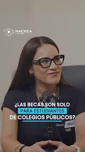

# Perfil de Jurado: Reegan Orozco

## Información General
* **Cargo Actual:** Directora Ejecutiva de la Asociación Patronato BCP y Gerente Adjunto de Responsabilidad Social del BCP (líder directa del programa Becas BCP).
* **Rol en el Patronato:** Directora Ejecutiva (máxima autoridad en la gestión diaria, diseño operativo e implementación del programa de Becas BCP).
* **Formación Académica:** 
  * Investigadora y bachiller egresada de la Pontificia Universidad Católica del Perú (PUCP) con especialización en Ciencias Sociales/Economía.
* **Trayectoria:** Especialista en diseño e implementación de programas de financiamiento y acompañamiento educativo. Es la vocera y el rostro más visible del Patronato BCP ante la opinión pública y los estudiantes.

---

## Trayectoria Profesional y Logros Clave

* **Liderazgo en Becas BCP:** Dirige el programa bandera del Patronato BCP, el cual otorga becas integrales para estudios universitarios y técnicos. Bajo su gestión, el programa ha potenciado su modelo de acompañamiento, logrando no solo financiar estudios sino asegurar una transición exitosa al mercado laboral.
* **Experiencia en PRONABEC:** Se desempeñó como especialista de acompañamiento estudiantil y orientación vocacional en el Programa Nacional de Becas y Crédito Educativo (Pronabec) del Ministerio de Educación, lo cual le brindó una sólida experiencia en los cuellos de botella de la retención y la inserción de jóvenes de bajos recursos.
* **Investigadora sobre Clima Escolar y Rendimiento:** Es coautora del estudio académico *“Violencia, escuelas y desempeño educativo escolar: Formas y consecuencias de ser víctima de violencia en la etapa escolar”* (2017), desarrollado de la mano con el Consorcio de Investigación Económica y Social (CIES) y la PUCP. Este estudio analizó los impactos del bullying y la violencia en el éxito del estudiante.
* **Host y Comunicadora en Podcasts de Orientación:** Conduce y participa activamente como vocera en espacios digitales de orientación vocacional y marca personal como los podcasts *Hackea tu Futuro* y *Vocacción*, diseñados para empoderar a los jóvenes en la toma de decisiones profesionales y la búsqueda de empleo.

---

## Visión y Enfoques Clave

### 1. Clima y Salud Mental (El Lente de su Investigación)
Habiendo investigado a fondo la violencia escolar y su impacto negativo en las calificaciones y la autoestima de los estudiantes:
* Es sumamente sensible a los temas de salud mental, acoso (bullying), estrés académico y soporte socioemocional de los jóvenes.
* Valora enormemente los proyectos que incorporen canales seguros y confidenciales de apoyo psicológico o contención emocional.

### 2. Acompañamiento 360° e Inserción (Hackea tu Futuro)
Considera que una beca no es solo dar financiamiento para pagar pensiones universitarias:
* Defiende la tesis de que se debe dotar al joven de herramientas de **marca personal**, redacción de currículum (CV), desenvolvimiento en entrevistas de trabajo y redes de contactos (networking) desde el primer ciclo.
* Promueve la mentoría constante por parte de líderes profesionales (voluntariado corporativo del BCP).

### 3. Procesos de Selección Inclusivos y Amigables
Como exespecialista de Pronabec:
* Conoce detalladamente los procesos de postulación (exámenes, pruebas psicométricas y entrevistas socioeconómicas).
* Busca que las interfaces de postulación sean intuitivas, amigables y no generen una barrera de entrada innecesaria para jóvenes con baja alfabetización digital.

---

## Estrategia para el Pitch y Defensa del Proyecto

Para persuadir a Reegan Orozco, el equipo debe demostrar que la solución pone en el centro el bienestar emocional del becario, brinda herramientas activas de empleabilidad y cuenta con un canal de soporte sumamente cercano y empático.

### Ganchos de Empatía (Conceptos clave a incorporar)
* **"Acompañamiento Socioemocional Preventivo":** Mostrar que la plataforma no solo evalúa notas, sino que alerta tempranamente sobre problemas de estrés o acoso.
* **"Desarrollo de Marca Personal y Empleabilidad":** Incorporar el concepto de "Hackeo del futuro", mostrando cómo la solución ayuda a construir el perfil laboral del estudiante desde etapas iniciales.
* **"Experiencia de Usuario Amigable (Fricción Cero)":** Destacar que los flujos de postulación o interacción en el aplicativo son sumamente sencillos e inclusivos.
* **"Comunidad y Mentoría Activa":** Presentar el canal de comunicación entre becarios y mentores profesionales del BCP como un espacio vivo y enriquecedor.

### Preguntas Difíciles Esperadas y Cómo Responderlas

#### 1. En contextos vulnerables, muchos estudiantes abandonan el programa debido a problemas de salud mental, estrés o falta de apoyo en el hogar. ¿Cómo ayuda la plataforma a identificar estos casos de forma preventiva?
* **Enfoque de respuesta:** Detallar los sensores socioemocionales de la solución. "Nuestra plataforma incluye un módulo diario/semanal de 'Check-in de Bienestar', un espacio breve donde el estudiante registra su estado de ánimo mediante interacciones sencillas. Si el algoritmo detecta patrones de decaimiento constante o inactividad, se genera una alerta prioritaria en el panel del tutor/psicólogo asignado para que realice una llamada de acompañamiento preventivo".

#### 2. Las habilidades académicas son importantes, pero las habilidades para el empleo definen el éxito del becario. ¿Qué herramientas ofrece el proyecto para preparar a los estudiantes de cara a su inserción laboral?
* **Enfoque de respuesta:** Conectar con su visión de empleabilidad. "Hemos incorporado un módulo titulado 'Hackea tu Perfil', donde los estudiantes acceden a micro-cursos autoguiados sobre redacción de CV con Inteligencia Artificial, simulaciones de entrevistas mediante video-feedback y dinámicas grupales virtuales. El objetivo es que construyan su marca personal antes de graduarse".

#### 3. El proceso de selección de becarios suele ser estresante y complejo para los jóvenes. ¿Cómo logramos que la plataforma disminuya esta ansiedad durante las evaluaciones?
* **Enfoque de respuesta:** Explicar el enfoque lúdico y de soporte. "La fase de postulación en la aplicación ha sido diseñada con 'UX empática'. En lugar de cuestionarios masivos y fríos, las pruebas psicométricas y de perfil se presentan en formatos interactivos y gamificados. Además, la plataforma cuenta con un asistente virtual de soporte que guía al postulante en tiempo real ante cualquier duda técnica, disminuyendo la fricción y la ansiedad".

---

## Fuentes de Información
* **Investigaciones y Proyectos CIES/PUCP:** [Estudio sobre Violencia Escolar (2017) - Repositorio CIES](https://www.cies.org.pe)
* **Difusión y Programas del Patronato:** [Canal de Difusión Becas BCP - Viabcp](https://www.viabcp.com/becasbcp)
* **Podcast "Hackea tu Futuro" y Charlas Vocacionales:** [Spotify / YouTube BCP Perú](https://www.youtube.com)
* **Búsqueda Directa en LinkedIn:** [Resultados de búsqueda para Reegan Orozco](https://www.linkedin.com/search/results/all/?keywords=Reegan%20Orozco)
