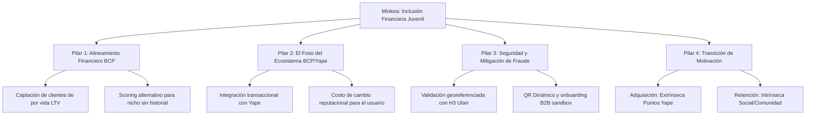

# Marco de Respuesta Estratégica - Jurado Hackathon BCP (Minkea)

Este documento sirve como marco conceptual y estratégico para responder las preguntas del jurado, integrando la visión del negocio, las métricas del Pitch y la arquitectura técnica del proyecto.

---

## 1. El Hilo Conductor: Unificando la Narrativa
El mayor peligro identificado en el análisis es que el jurado perciba que Minkea es "seis negocios distintos" (descubrimiento, incentivos, currículum, reputación, empleabilidad y scoring crediticio) y que el equipo está perdiendo el foco.

### **La Respuesta Unificadora (El Posicionamiento):**
> *"Minkea no es seis productos separados; es **una plataforma de inclusión financiera juvenil habilitada por conducta cívica**. El núcleo es la construcción de **confianza digital** donde no existe historial crediticio tradicional. El voluntariado es el mecanismo de captura de datos de comportamiento, los puntos Yape son el gancho de retención de corto plazo, y el scoring/microcréditos es el modelo de monetización y valor a largo plazo."*

---

## 2. Los 4 Pilares de Defensa (Defensive Plays)

Para responder de forma cohesionada y sin contradicciones a las preguntas de [preguntas_gemini.md](file:///D:/minkea/base/preguntas_originales/preguntas_gemini.md) y [preguntas_gpt.md](file:///D:/minkea/base/preguntas_originales/preguntas_gpt.md), utilizaremos esta matriz de 4 pilares:

### Pilar 1: El Valor Financiero para el BCP (ROI y Riesgo)
*   **Concepto clave:** Costo de Adquisición de Clientes (CAC) vs. Lifetime Value (LTV).
*   **Estrategia de respuesta:** 
    *   No estamos pidiendo dinero de donación. Estamos ofreciendo un canal de adquisición orgánica de usuarios jóvenes de alta fidelidad que el banco usualmente capta con campañas publicitarias costosas.
    *   **Data Alternativa:** El comportamiento cívico es un proxy de bajo riesgo. Un joven que cumple recurrentemente con tareas comunitarias y lidera grupos demuestra un perfil conductual de alta responsabilidad, reduciendo la asimetría de información y el riesgo de morosidad.

### Pilar 2: El Foso Defensivo (Por qué no nos copian)
*   **Concepto clave:** Integración de ecosistema.
*   **Estrategia de respuesta:**
    *   Cualquier competidor (como PROA) puede hacer un directorio de voluntariado, pero no puede integrar de forma nativa la recompensa financiera inmediata (Yape) ni el análisis de riesgo crediticio (BCP).
    *   El moat es el **Data Loop**: A más participación cívica, más datos conductuales tiene el BCP, mejorando el score del usuario y aumentando su costo de cambio (si se va a otra app, pierde su reputación acumulada).

### Pilar 3: Seguridad y Robustez Técnica (CTO Playbook)
*   **Concepto clave:** Mitigación de fraude automatizada y sin fricción operativa.
*   **Estrategia de respuesta:**
    *   **GPS Spoofing:** Mitigado a nivel de backend mediante indexación espacial hexagonal **H3** (validando presencia dentro de la celda del evento) y APIs de detección de mock locations.
    *   **Onboarding B2B:** Uso de un modelo tipo "Sandbox" o reputación progresiva para colectivos nuevos, eliminando la revisión manual masiva.
    *   **Blockchain e IA:** No son buzzwords de presentación. Son herramientas de escala de la Fase 3: la IA para match de pasiones y detección de fraudes de identidad; la Blockchain para dar portabilidad inmutable al currículum cívico fuera de Minkea.

### Pilar 4: Los "Mercenarios Cívicos" (Motivación Transaccional vs. Social)
*   **Concepto clave:** Teoría de la Autodeterminación (Motivación extrínseca vs. intrínseca).
*   **Estrategia de respuesta:**
    *   Los puntos Yape son el catalizador inicial (la recompensa extrínseca que rompe la inercia).
    *   La retención y sostenibilidad se apoya en la motivación intrínseca (conocer personas afines - 63.6% en nuestra encuesta) y la motivación de logro (crecimiento del perfil cívico para empleabilidad futura).

---

## 3. Hoja de Ruta para Responder [preguntas_gpt.md](file:///D:/minkea/base/preguntas_originales/preguntas_gpt.md) (Mapeo Estratégico)

Para el ensayo del pitch, utilizaremos esta guía rápida de respuestas para la sección operativa de la lista:

1.  **Preguntas de Muestra/Encuesta (Q2, Q3):**
    *   *Línea defensiva:* "Nuestra encuesta de Mayo 2026 (18-30 años) sirvió para validar la hipótesis cualitativa inicial. Para la Fase 1 (MVP) en Lima, utilizaremos el piloto cerrado con 3 organizaciones juveniles para establecer la métrica de conversión real antes del escalado masivo."
2.  **Preguntas de Actividad Política/Extrema o Proselitismo (Q45, Q46):**
    *   *Línea defensiva:* "El onboarding automatizado filtra colectivos por su registro formal en SENAJU o Municipalidades. Además, las misiones pasan por un pipeline de análisis de texto automático en el backend para descartar keywords y contenidos vinculados a proselitismo político o sectario antes de ser listados."

---

## 4. Bloque Crítico: Respuestas para Q47 - Q55 y Pregunta Decisiva

Este es el bloque de defensa final para las preguntas más difíciles del jurado técnico, de negocios y el dilema existencial del producto:

### **Q47. ¿Cómo evitan estafas de usuarios (acumulación falsa de puntos)?**
*   **Respuesta/Marco:** Ver el detalle de las 3 propuestas técnicas de prevención de fraude y la defensa ante réplicas del jurado en el archivo dedicado: [pregunta_47.md](file:///D:/minkea/base/defensa_fraude/pregunta_47.md).

### **Q48. ¿Cómo evitan organizaciones y actividades fraudulentas (falsos eventos)?**
*   **Respuesta/Marco:** Filtros progresivos y control comunitario:
    *   **Identidad Gubernamental:** Integración vía API con SUNARP y padrones de organizaciones juveniles para verificar la personería del colectivo en el onboarding.
    *   **Sandbox de Confianza:** Las organizaciones nuevas entran en un estado "semi-verificado", pudiendo publicar inicialmente solo misiones con bajas recompensas. Su reputación y límites de puntos asignables aumentan de forma automatizada según la calificación positiva de los usuarios (crowdsourced verification).
    *   **Flagging Automatizado:** Si tres usuarios verificados en el lugar del evento reportan una anomalía o evento falso, la misión y la cuenta del colectivo son suspendidas automáticamente a la espera de auditoría manual.

### **Q49. ¿Quién responde ante un accidente durante una actividad?**
*   **Respuesta/Marco:** Responsabilidad delimitada y prevención:
    *   **Deslinde Legal:** En los Términos y Condiciones, Minkea se establece como una plataforma agregadora de conexión (marketplace), similar al modelo de Uber. La responsabilidad civil de la seguridad del evento recae en la organización que publica la actividad.
    *   **Declaración de Medidas:** En el onboarding del evento, los colectivos deben declarar sus protocolos de primeros auxilios y si cuentan con seguro de incidentes, lo cual es visible para el voluntario antes de postular.
    *   **Fase 2 (Seguro de Voluntariado BCP):** Se plantea introducir micro-seguros contra accidentes por día de misión, integrados directamente en la app y financiados a bajo costo o asumidos corporativamente como beneficio de RSE del BCP.

### **Q50. ¿Por qué creen que los jóvenes necesitan una aplicación y no simplemente más liderazgo en sus comunidades?**
*   **Respuesta/Marco:** El liderazgo comunitario existe, pero la fricción operativa actual previene la acción masiva.
    *   Los jóvenes de hoy tienen agendas saturadas y desconfían de los canales tradicionales (chats de WhatsApp inactivos, posts en Facebook sin verificación).
    *   Minkea no reemplaza al líder; le da **tecnología de escala**. Reduce a cero el costo de búsqueda de misiones confiables y flexibles (de 2 a 4 horas), transformando el interés cívico en una acción simple, estructurada y verificable que además aporta a su desarrollo laboral y financiero.

### **Q51. ¿Qué les hace pensar que el problema es tecnológico?**
*   **Respuesta/Marco:** Es un problema de asimetría informativa y de incentivos de marketplace.
    *   El 70.4% de los jóvenes está conectado a internet diariamente y el 63.6% desea conectar con otros, pero solo el 5.8% participa activamente. Esta brecha indica que el voluntariado tradicional no encaja con la experiencia de usuario hiperconectada de hoy.
    *   Se requiere un matching inteligente (reducir fricción informativa) y un sistema gamificado de incentivos (motivar la conversión digital-a-física). Resolver un problema de escala en un marketplace requiere de una plataforma tecnológica sólida.

### **Q52. ¿Cuál es la hipótesis más importante de todo el proyecto?**
*   **Respuesta/Marco:** Nuestra hipótesis de valor fundamental es:
    *   *"La conducta cívica recurrente y verificable es un proxy confiable de bajo riesgo crediticio (responsabilidad y comportamiento de pago) para jóvenes sin historial financiero tradicional (Thin Files)."*
    *   **Si la hipótesis es falsa:** El modelo de negocio de microcréditos y tasas preferenciales de Minkea se cae. En ese escenario, Minkea pivotaría hacia una plataforma SaaS pura de marketing de impacto ESG para sponsors B2B y convalidación de horas de RSE corporativa/universitaria.

### **Q53. ¿Qué aprendieron hablando con usuarios que los hizo cambiar de opinión?**
*   **Respuesta/Marco:** El pivot del altruismo puro al modelo de incentivo transaccional.
    *   Inicialmente planeamos una plataforma de voluntariado tradicional basada en reputación moral. Sin embargo, en las entrevistas iniciales descubrimos que la inercia diaria y las presiones económicas de los jóvenes eran barreras insalvables.
    *   El 72.7% indicó explícitamente que querían descuentos y beneficios. Esto nos forzó a integrar el sistema de **puntos Yape** como la "grúa de arranque" para romper la inercia, balanceándolo con motivadores intrínsecos de comunidad para la retención.

### **Q54. Si les doy solo 50 mil soles, ¿qué experimento ejecutarían para demostrar que esto funciona?**
*   **Respuesta/Marco:** El Piloto Mínimo Viable (MVP) de Conversión y Retención:
    1.  **Desarrollo (10k PEN):** Creación de una versión básica web no-code (Glide/FlutterFlow) conectada a base de datos relacional para 3 organizaciones aliadas en Lima.
    2.  **Incentivos (40k PEN):** Presupuesto de recompensas manuales en vales o transferencias Yape controladas para un grupo de 500 voluntarios activos.
    3.  **KPI del experimento:** Demostrar que el match inteligente por pasiones y el factor de gamificación incrementan la conversión de registros digitales en asistencias físicas a eventos en al menos un 35% en comparación con la difusión pasiva por redes sociales.

### **Q55. ¿Qué les haría abandonar completamente la idea?**
*   **Respuesta/Marco:** Dos factores insalvables:
    1.  **Cero correlación de riesgo:** Que los primeros datos del piloto demuestren que la morosidad de jóvenes con alto currículum cívico es igual o mayor que la del segmento promedio sin historial.
    2.  **Bloqueo Regulatorio (SBS):** Que la regulación de la SBS impida de manera absoluta el uso de perfiles de conducta alternativa para la flexibilización de requisitos de entrada a productos de crédito.

### **Q56 (Adopción/Cold Start). ¿Cómo se aseguran de que el usuario rompa la inercia y realice sus primeras participaciones en Minkea?**
*   **Respuesta/Marco:** Ver el detalle de la estrategia de activación en tres capas (squads, bono de bienvenida y convalidación universitaria/B2B) en el archivo dedicado: [pregunta_adopcion.md](file:///D:/minkea/base/defensa_adopcion/pregunta_adopcion.md).

---

### **La Pregunta Decisiva / Q14: "Si mañana desaparecieran los puntos Yape y beneficios económicos, ¿seguiría existiendo Minkea?"**
*   **Respuesta/Marco:** **Sí, porque el valor transaccional solo es la rampa de entrada (adquisición), no el destino (retención).**
    *   *Ver detalle de marco de defensa y alternativas directas:* [pregunta_14.md](file:///D:/minkea/base/defensa_incentivos/pregunta_14.md).
    *   Los puntos Yape reducen la fricción para que el usuario cruce la puerta de su primer voluntariado.
    *   Una vez dentro, la retención se sostiene en la **empleabilidad y el estatus profesional**. El "Currículum Cívico" validado en procesos de selección laboral corporativos e ingresos a universidades provee una recompensa intangible pero vitalicia (empleo real, redes de confianza). Minkea evoluciona de ser una app de recompensas a convertirse en la red de reputación profesional de la juventud peruana.

---

## 5. Sección de Microcréditos (Preguntas 24 a 28)

Esta sección aborda la viabilidad financiera, el riesgo crediticio y la regulación SBS ante el jurado financiero:

*   **Q24. ¿Por qué una actividad comunitaria debería reducir el riesgo crediticio?**
    *   *Ver detalle de respuesta y réplicas:* [pregunta_24.md](file:///D:/minkea/base/defensa_microcreditos/pregunta_24.md).
*   **Q25. ¿Qué evidencia existe de correlación entre civismo y capacidad de pago?**
    *   *Ver detalle de respuesta y réplicas:* [pregunta_25.md](file:///D:/minkea/base/defensa_microcreditos/pregunta_25.md).
*   **Q26. ¿Cómo justificarían ante regulación y riesgo del banco otorgar condiciones preferenciales?**
    *   *Ver detalle de respuesta y réplicas:* [pregunta_26.md](file:///D:/minkea/base/defensa_microcreditos/pregunta_26.md).
*   **Q27. ¿No estarían creando un sistema fácilmente explotable?**
    *   *Ver detalle de respuesta y réplicas:* [pregunta_27.md](file:///D:/minkea/base/defensa_microcreditos/pregunta_27.md).
*   **Q28. ¿Qué pasaría si un mal pagador tiene un excelente perfil cívico?**
    *   *Ver detalle de respuesta y réplicas:* [pregunta_28.md](file:///D:/minkea/base/defensa_microcreditos/pregunta_28.md).
