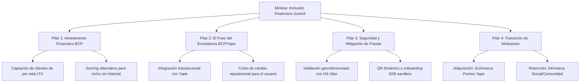

# Marco de Respuesta Estratégica - Jurado Hackathon BCP (Minkea)

Este documento sirve como marco conceptual y estratégico para responder las preguntas del jurado, integrando la visión del negocio, las métricas del Pitch y la arquitectura técnica del proyecto.

---

## 1. El Hilo Conductor: Unificando la Narrativa
El mayor peligro identificado en el análisis es que el jurado perciba que Minkea es "seis negocios distintos" (descubrimiento, incentivos, currículum, reputación, empleabilidad y scoring crediticio) y que el equipo está perdiendo el foco.

### **La Respuesta Unificadora (El Posicionamiento):**
> *"Minkea no es seis productos separados; es **una plataforma de inclusión financiera juvenil habilitada por conducta cívica**. El núcleo es la construcción de **confianza digital** donde no existe historial crediticio tradicional. El voluntariado es el mecanismo de captura de datos de comportamiento, los puntos Yape son el gancho de retención de corto plazo, y el scoring/microcréditos es el modelo de monetización y valor a largo plazo."*

---

## 2. Los 4 Pilares de Defensa (Defensive Plays)

Para responder de forma cohesionada y sin contradicciones a las preguntas de [preguntas_gemini.md](file:///D:/minkea/base/preguntas_originales/preguntas_gemini.md) y [preguntas_gpt.md](file:///D:/minkea/base/preguntas_originales/preguntas_gpt.md), utilizaremos esta matriz de 4 pilares:

### Pilar 1: El Valor Financiero para el BCP (ROI y Riesgo)
*   **Concepto clave:** Costo de Adquisición de Clientes (CAC) vs. Lifetime Value (LTV).
*   **Estrategia de respuesta:** 
    *   No estamos pidiendo dinero de donación. Estamos ofreciendo un canal de adquisición orgánica de usuarios jóvenes de alta fidelidad que el banco usualmente capta con campañas publicitarias costosas.
    *   **Data Alternativa:** El comportamiento cívico es un proxy de bajo riesgo. Un joven que cumple recurrentemente con tareas comunitarias y lidera grupos demuestra un perfil conductual de alta responsabilidad, reduciendo la asimetría de información y el riesgo de morosidad.

### Pilar 2: El Foso Defensivo (Por qué no nos copian)
*   **Concepto clave:** Integración de ecosistema.
*   **Estrategia de respuesta:**
    *   Cualquier competidor (como PROA) puede hacer un directorio de voluntariado, pero no puede integrar de forma nativa la recompensa financiera inmediata (Yape) ni el análisis de riesgo crediticio (BCP).
    *   El moat es el **Data Loop**: A más participación cívica, más datos conductuales tiene el BCP, mejorando el score del usuario y aumentando su costo de cambio (si se va a otra app, pierde su reputación acumulada).

### Pilar 3: Seguridad y Robustez Técnica (CTO Playbook)
*   **Concepto clave:** Mitigación de fraude automatizada y sin fricción operativa.
*   **Estrategia de respuesta:**
    *   **GPS Spoofing:** Mitigado a nivel de backend mediante indexación espacial hexagonal **H3** (validando presencia dentro de la celda del evento) y APIs de detección de mock locations.
    *   **Onboarding B2B:** Uso de un modelo tipo "Sandbox" o reputación progresiva para colectivos nuevos, eliminando la revisión manual masiva.
    *   **Blockchain e IA:** No son buzzwords de presentación. Son herramientas de escala de la Fase 3: la IA para match de pasiones y detección de fraudes de identidad; la Blockchain para dar portabilidad inmutable al currículum cívico fuera de Minkea.

### Pilar 4: Los "Mercenarios Cívicos" (Motivación Transaccional vs. Social)
*   **Concepto clave:** Teoría de la Autodeterminación (Motivación extrínseca vs. intrínseca).
*   **Estrategia de respuesta:**
    *   Los puntos Yape son el catalizador inicial (la recompensa extrínseca que rompe la inercia).
    *   La retención y sostenibilidad se apoya en la motivación intrínseca (conocer personas afines - 63.6% en nuestra encuesta) y la motivación de logro (crecimiento del perfil cívico para empleabilidad futura).

---

## 3. Hoja de Ruta para la Defensa Completa (Mapeo por Categorías)

Para preparar la ronda de preguntas, hemos organizado las respuestas a las 55 preguntas de [preguntas_gpt.md](file:///D:/minkea/base/preguntas_originales/preguntas_gpt.md) y [preguntas_gemini.md](file:///D:/minkea/base/preguntas_originales/preguntas_gemini.md) en una estructura de carpetas de defensa dedicada. Cada archivo individual provee dos alternativas de respuesta y el manejo de réplicas:

### **Pilar I: El Problema (Adquisición y Encuesta)**
* **Ubicación:** [defensa_problema](file:///D:/minkea/base/defensa_problema)
* **Preguntas Resueltas:**
  * [apatia_falta_incentivos.md](file:///D:/minkea/base/defensa_problema/apatia_falta_incentivos.md) - Falta de incentivos vs. apatía juvenil (Interés real).
  * [tamano_muestra_encuesta.md](file:///D:/minkea/base/defensa_problema/tamano_muestra_encuesta.md) - Tamaño de la muestra y validez estadística.
  * [representatividad_nacional_provincias.md](file:///D:/minkea/base/defensa_problema/representatividad_nacional_provincias.md) - Representatividad a nivel nacional (provincias).
  * [cazadores_beneficios_genuino.md](file:///D:/minkea/base/defensa_problema/cazadores_beneficios_genuino.md) - Participación genuina vs. caza de beneficios.
  * [evidencia_barreras_principales.md](file:///D:/minkea/base/defensa_problema/evidencia_barreras_principales.md) - Evidencia de las 3 barreras principales.

### **Pilar II: La Solución (Plataforma y Verificación)**
* **Ubicación:** [defensa_solucion](file:///D:/minkea/base/defensa_solucion) y [defensa_adopcion](file:///D:/minkea/base/defensa_adopcion)
* **Preguntas Resueltas:**
  * [activacion_primeras_participaciones.md](file:///D:/minkea/base/defensa_adopcion/activacion_primeras_participaciones.md) - Cómo romper el Cold Start e incentivar la primera asistencia (Q56 / Q7 / Q8).
  * [flujo_usuario_colectivo.md](file:///D:/minkea/base/defensa_solucion/flujo_usuario_colectivo.md) - Flujo y viaje detallado de los voluntarios y organizaciones (UX / Journey).
  * [funcionalidades_alcance_mvp.md](file:///D:/minkea/base/defensa_solucion/funcionalidades_alcance_mvp.md) - Definición del alcance del MVP y justificación de funciones diferidas (Lean Scope).
  * [diferenciacion_redes_sociales.md](file:///D:/minkea/base/defensa_solucion/diferenciacion_redes_sociales.md) - Diferencia y valor frente a Instagram, Facebook y WhatsApp.
  * [friccion_descarga_app.md](file:///D:/minkea/base/defensa_solucion/friccion_descarga_app.md) - Motivadores de descarga (fricción de app nueva).
  * [marketplace_cold_start.md](file:///D:/minkea/base/defensa_solucion/marketplace_cold_start.md) - Marketplace cold start (si nadie publica misiones).
  * [onboarding_creadores_actividades.md](file:///D:/minkea/base/defensa_solucion/onboarding_creadores_actividades.md) - Quién crea y alimenta las misiones en la app (B2B onboarding).
  * [verificacion_asistencia_campo.md](file:///D:/minkea/base/defensa_solucion/verificacion_asistencia_campo.md) - Método técnico para verificar la asistencia física del usuario.
  * [medicion_calidad_participacion.md](file:///D:/minkea/base/defensa_solucion/medicion_calidad_participacion.md) - Medición y calificación de la calidad de participación.
  * [moderacion_actividades_falsas.md](file:///D:/minkea/base/defensa_solucion/moderacion_actividades_falsas.md) - Evitar y moderar actividades falsas en el feed.

### **Pilar III: Los Incentivos y ROI**
* **Ubicación:** [defensa_incentivos](file:///D:/minkea/base/defensa_incentivos) y [defensa_gobierno](file:///D:/minkea/base/defensa_gobierno)
* **Preguntas Resueltas:**
  * [viabilidad_sin_yape.md](file:///D:/minkea/base/defensa_incentivos/viabilidad_sin_yape.md) - Qué pasa si desaparecen los puntos Yape (Pregunta Decisiva).
  * [retorno_inversion_bcp.md](file:///D:/minkea/base/defensa_incentivos/retorno_inversion_bcp.md) - Retorno de Inversión (ROI) y valor estratégico para el BCP.
  * [financiamiento_recompensas_escala.md](file:///D:/minkea/base/defensa_incentivos/financiamiento_recompensas_escala.md) - Presupuesto e impacto de financiamiento a escala masiva.
  * [cese_incentivos_retencion.md](file:///D:/minkea/base/defensa_incentivos/cese_incentivos_retencion.md) - Retención tras el fin de campañas de beneficios temporales.
  * [habito_recompensa_conducta.md](file:///D:/minkea/base/defensa_incentivos/habito_recompensa_conducta.md) - Sustento conductual de recompensas en la formación de hábitos.
  * [respaldo_gubernamental_convalidacion.md](file:///D:/minkea/base/defensa_gobierno/respaldo_gubernamental_convalidacion.md) - Rol del Estado en la Fase 4 y viabilidad financiera a largo plazo (P7).

### **Pilar IV: El Currículum Cívico (Reputación Laboral)**
* **Ubicación:** [defensa_curriculum](file:///D:/minkea/base/defensa_curriculum)
* **Preguntas Resueltas:**
  * [valor_curriculum_empresas.md](file:///D:/minkea/base/defensa_curriculum/valor_curriculum_empresas.md) - Por qué las empresas valoran este historial (Costo de selección).
  * [traduccion_competencias_laborales.md](file:///D:/minkea/base/defensa_curriculum/traduccion_competencias_laborales.md) - Traducción de actividades físicas a competencias laborales.
  * [seguridad_curriculum_manipulacion.md](file:///D:/minkea/base/defensa_curriculum/seguridad_curriculum_manipulacion.md) - Seguridad ante manipulación y suplantación de la credencial.
  * [ponderacion_escala_misiones.md](file:///D:/minkea/base/defensa_curriculum/ponderacion_escala_misiones.md) - Quién pondera y clasifica el valor de las misiones comunitarias.
  * [inclusividad_brecha_tiempo.md](file:///D:/minkea/base/defensa_curriculum/inclusividad_brecha_tiempo.md) - Inclusión y mitigación del sesgo de falta de tiempo libre.

### **Pilar V: Microcréditos y Regulación (El Negocio)**
* **Ubicación:** [defensa_microcreditos](file:///D:/minkea/base/defensa_microcreditos)
* **Preguntas Resueltas:**
  * [civismo_riesgo_crediticio.md](file:///D:/minkea/base/defensa_microcreditos/civismo_riesgo_crediticio.md) - Correlación de civismo con reducción de riesgo.
  * [evidencia_voluntad_pago.md](file:///D:/minkea/base/defensa_microcreditos/evidencia_voluntad_pago.md) - Evidencia global sobre voluntad de pago y civismo.
  * [regulacion_sbs_riesgos.md](file:///D:/minkea/base/defensa_microcreditos/regulacion_sbs_riesgos.md) - Justificación regulatoria ante la SBS para flexibilizar riesgos.
  * [explotacion_sistema_credito.md](file:///D:/minkea/base/defensa_microcreditos/explotacion_sistema_credito.md) - Mitigación ante la explotación oportunista de crédito.
  * [morosidad_perfil_civico.md](file:///D:/minkea/base/defensa_microcreditos/morosidad_perfil_civico.md) - Manejo de la morosidad de un usuario con perfil cívico alto.

### **Pilar VI: Competencia y Foso Defensivo**
* **Ubicación:** [defensa_competencia](file:///D:/minkea/base/defensa_competencia)
* **Preguntas Resueltas:**
  * [defendibilidad_copia_yape.md](file:///D:/minkea/base/defensa_competencia/defendibilidad_copia_yape.md) - Qué hace a Minkea defendible ante una copia de Yape en 6 meses.
  * [ventaja_competitiva_proa.md](file:///D:/minkea/base/defensa_competencia/ventaja_competitiva_proa.md) - Ventajas sobre directorios tradicionales (PROA, Bicentenario).
  * [barreras_entrada_moat.md](file:///D:/minkea/base/defensa_competencia/barreras_entrada_moat.md) - Barreras de entrada de negocio y data loops.
  * [novedad_mercado_peruano.md](file:///D:/minkea/base/defensa_competencia/novedad_mercado_peruano.md) - Por qué no se ha hecho antes en el mercado local.

### **Pilar VII: El Impacto Estimado**
* **Ubicación:** [defensa_impacto](file:///D:/minkea/base/defensa_impacto)
* **Preguntas Resueltas:**
  * [proyeccion_mercado_activacion.md](file:///D:/minkea/base/defensa_impacto/proyeccion_mercado_activacion.md) - Origen del 23.8% de penetración del mercado direccionable.
  * [aumento_participacion_real.md](file:///D:/minkea/base/defensa_impacto/aumento_participacion_real.md) - Justificación del aumento de participación del 5.8% al 23.8%.
  * [metricas_exito_piloto.md](file:///D:/minkea/base/defensa_impacto/metricas_exito_piloto.md) - Métricas de éxito en los primeros 12 meses de operación.
  * [north_star_metric.md](file:///D:/minkea/base/defensa_impacto/north_star_metric.md) - Definición del KPI principal (North Star Metric).
  * [atribucion_impacto_experimento.md](file:///D:/minkea/base/defensa_impacto/atribucion_impacto_experimento.md) - Atribución de causalidad (Experimentos A/B).

### **Pilar VIII: Escalabilidad y Costos**
* **Ubicación:** [defensa_escalabilidad](file:///D:/minkea/base/defensa_escalabilidad)
* **Preguntas Resueltas:**
  * [costo_adquisicion_usuario.md](file:///D:/minkea/base/defensa_escalabilidad/costo_adquisicion_usuario.md) - Costo de adquisición por usuario (CAC) vs. canales de pauta.
  * [costo_operacion_mision.md](file:///D:/minkea/base/defensa_escalabilidad/costo_operacion_mision.md) - Costos operativos por actividad completada en la nube.
  * [financiamiento_backend_saas.md](file:///D:/minkea/base/defensa_escalabilidad/financiamiento_backend_saas.md) - Financiamiento del backend de manera independiente.
  * [modelo_monetizacion_sostenible.md](file:///D:/minkea/base/defensa_escalabilidad/modelo_monetizacion_sostenible.md) - Monetización B2B y sustentación financiera a largo plazo.
  * [contingencia_salida_bcp.md](file:///D:/minkea/base/defensa_escalabilidad/contingencia_salida_bcp.md) - Estrategia de salida ante la retirada de Yape/BCP.
  * [autosuficiencia_sin_estado.md](file:///D:/minkea/base/defensa_escalabilidad/autosuficiencia_sin_estado.md) - Viabilidad del modelo sin apoyo gubernamental o subsidios.

### **Pilar IX: Mitigación de Riesgos**
* **Ubicación:** [defensa_riesgos](file:///D:/minkea/base/defensa_riesgos) y [defensa_fraude](file:///D:/minkea/base/defensa_fraude)
* **Preguntas Resueltas:**
  * [prevencion_fraude_usuarios.md](file:///D:/minkea/base/defensa_fraude/prevencion_fraude_usuarios.md) - Fraude técnico (GPS spoofing, check-ins falsos, etc.).
  * [riesgo_reputacional_bcp.md](file:///D:/minkea/base/defensa_riesgos/riesgo_reputacional_bcp.md) - Riesgo reputacional directo para la marca BCP.
  * [control_contenido_politico.md](file:///D:/minkea/base/defensa_riesgos/control_contenido_politico.md) - Control y bloqueo de misiones con fines de activismo político.
  * [neutralidad_proselitismo_religioso.md](file:///D:/minkea/base/defensa_riesgos/neutralidad_proselitismo_religioso.md) - Control y bloqueo de proselitismo religioso camuflado.
  * [sandbox_colectivos_falsos.md](file:///D:/minkea/base/defensa_riesgos/sandbox_colectivos_falsos.md) - Prevención de organizaciones y misiones fantasmas.
  * [responsabilidad_legal_accidentes.md](file:///D:/minkea/base/defensa_riesgos/responsabilidad_legal_accidentes.md) - Responsabilidad legal y civil ante accidentes en campo.

### **Pilar X: El Jurado más Duro (Dilemas Estratégicos)**
* **Ubicación:** [defensa_jurado](file:///D:/minkea/base/defensa_jurado)
* **Preguntas Resueltas:**
  * [necesidad_app_liderazgo.md](file:///D:/minkea/base/defensa_jurado/necesidad_app_liderazgo.md) - Por qué los jóvenes necesitan software y no liderazgo local.
  * [tecnologia_friccion_social.md](file:///D:/minkea/base/defensa_jurado/tecnologia_friccion_social.md) - Justificación de la tecnología frente a un reto cultural.
  * [hipotesis_mayor_riesgo.md](file:///D:/minkea/base/defensa_jurado/hipotesis_mayor_riesgo.md) - Cuál es la hipótesis más arriesgada de la propuesta.
  * [aprendizajes_pivot_usuarios.md](file:///D:/minkea/base/defensa_jurado/aprendizajes_pivot_usuarios.md) - Pivot de diseño aprendido en las entrevistas con usuarios.
  * [experimento_presupuesto_minimo.md](file:///D:/minkea/base/defensa_jurado/experimento_presupuesto_minimo.md) - Experimento de validación rápida con S/ 50k.
  * [criterios_abandono_proyecto.md](file:///D:/minkea/base/defensa_jurado/criterios_abandono_proyecto.md) - Qué datos obligarían a abandonar la idea por completo.

### **Pilar XI: Defensa Técnica y Arquitectura (Blockchain e IA)**
* **Ubicación:** [defensa_tecnica](file:///D:/minkea/base/defensa_tecnica)
* **Preguntas Resueltas:**
  * [blockchain_ia_overengineering.md](file:///D:/minkea/base/defensa_tecnica/blockchain_ia_overengineering.md) - Utilidad y justificación de Blockchain e IA en una app cívica (mitigación de over-engineering).

